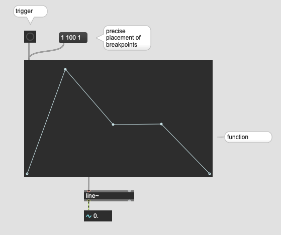
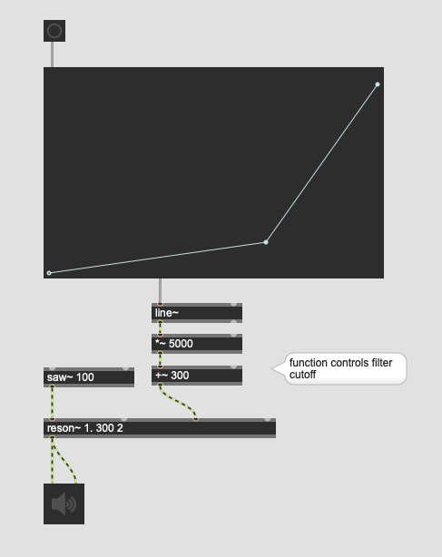
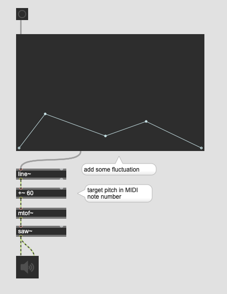

# K1: Envelope

In sound and music, an envelope describes how a sound changes over time. It may relate to elements such as amplitude (volume), frequencies (with the use of filters) or pitch. For example, a piano key, when struck and held, creates a near-immediate initial sound which gradually decreases in volume to zero.

## ADSR envelope

The most common kind of envelope generator has four stages: attack, decay, sustain, and release (ADSR).

- Attack is the time taken for initial run-up of level from nil to peak, beginning when the key is pressed.
- Decay is the time taken for the subsequent run down from the attack level to the designated sustain level.
- Sustain is the level during the main sequence of the sound's duration, until the key is released.
- Release is the time taken for the level to decay from the sustain level to zero after the key is released.
While attack, decay, and release refer to time, sustain refers to level.

### Assignment 1

program an adsr envelope in Max and apply it to 440 Hz sine wave where

A ... 0.5 s  
D ... 0.5 s  
S ... 0.75  
R ... 1 s  

- The sustain time should be fixed to 2 s.  
- A bang should trigger the envelope.
- Avoid using function GUI object
- Try using as few objects as possible

## Function object

- function = envelope visualizer  

### Assignment 2

Implement assignment 1 again using function object

## Make sustain time flexible

### Assignment 3

With kslider in the polyphonic mode, we can simulate note on and not off MIDI messages.
Combine this with the function object and create a monophonic sine wave synthesizer by letting  the envelope enter the release phase when the key is released (note off message is emitted by the kslider)

- the velocity from the key slider should influence the actual loudness of the sine wave
- MIDI note number should control the frequency of the sine wave (hint: mtof)

Note: We don't cover the case that multiple keys are pressed simultaneously

## Think Flexibly: Envelope is not only for Amplitude

The output from the function is just a pure signal we don't have to apply this always to amplitude.

### Assignment 4 : multiple function 

in the patch for the assignment 3, replace the sine oscillator (cycle~) with sawtooth (saw~), add reson~ for filtering the output of saw~. Then, control the transition of the cutoff frequency of the reson~ by adding one more function and necessary supplemental objects.

