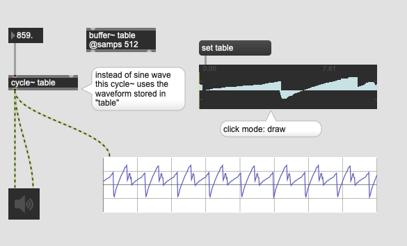

# K2: Wavetable synthesis

## Table-lookup synthesis

### Assignment 1

Fill the table with a saw tooth wave programatically and generate saw tooth wave from cycle~.

### Assignment 2

The waveform output from cycle~ won't be change even if the content of buffer~ "table" is changed. Solve this problem by replacing cycle~ with another object and update the waveform in realtime.

Hint: wave~

---
## Sample-based Synthesis

Sample-based synthesis uses recorded waveforms instead of scientifically created waveforms (sine, triangle, or saw) in the context of wavetable synthesis.

### Assignment 3

Load the [Flute sample](K2/flute60.wav) onto the patch, observe the waveform of the recorded flute sound, find the repetition of the waveforms in it.

Then use one cycle of the flute's waveform instead of manually or programatically created waveform in table-lookup synthesis; This is the fundamental of the sample-based synthesis.

## Waveform crossfading

## Wave Stacking

## Wave Terrain Synthesis

