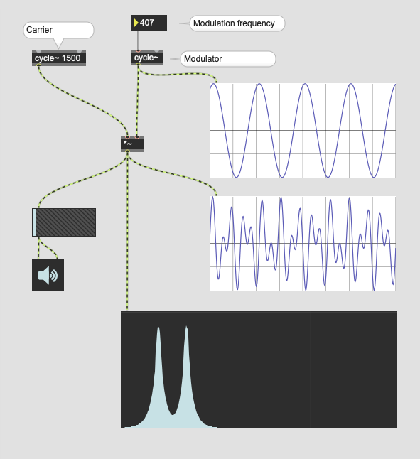

# K4: Modulation Synthesis (1)

## Ring Modulation

### Assignment 1

Download [piano](K4/piano.aif.zip) sample and use this as the source instead of "cycle~ 1500" and observe the spectrum generated by the ring modulation

## Amplitude Modulation

Amplitude Modulation is very similar to the ring modulation. However, it uses "Unipolar" signal as a modulator.

### Assignment 2
cycle~ generates a bipolar sine wave, process the output of cycle~ and generate a unipolar sine wave.

### Assignment 3
Compare the spectral result of Ring Modulation and Amplitude modulation by using 1000 Hz sine wave as an input.

## Anatomy of RM and AM

Both RM and AM generates more partials in the spectrum. Those added partials are called **sidebands**.

The modulation frequency controls the distance between the carrier (the source) and the sidebands.

This means, if the modulation frequency is a multiple of carrier frequency, we could perceive sidebands as timbre.

## Assignment 4 
The piano sample downloaded is E5 (659.255127 Hz). 
Apply AM to it and align the modulation frequency to this frequency or multiple of this frequency and listen to the output sound.
Compare the result with unaligned modulation frequency.

## Frequency modulation

