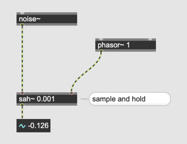
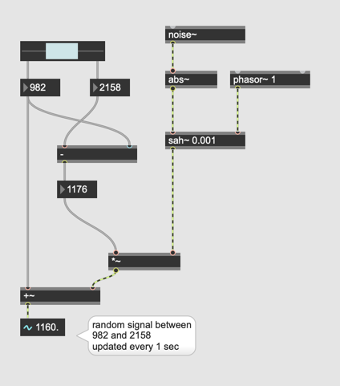
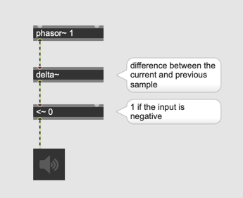
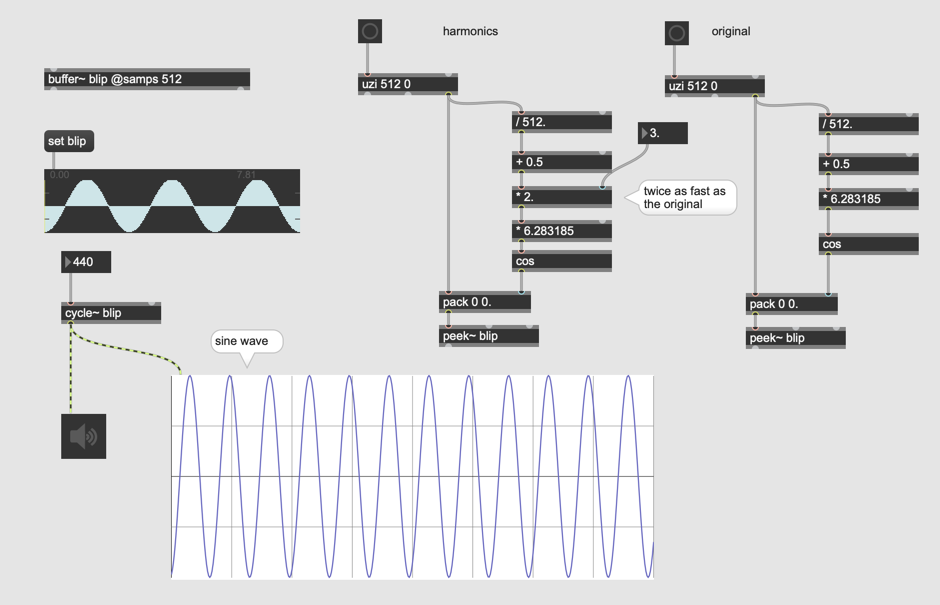
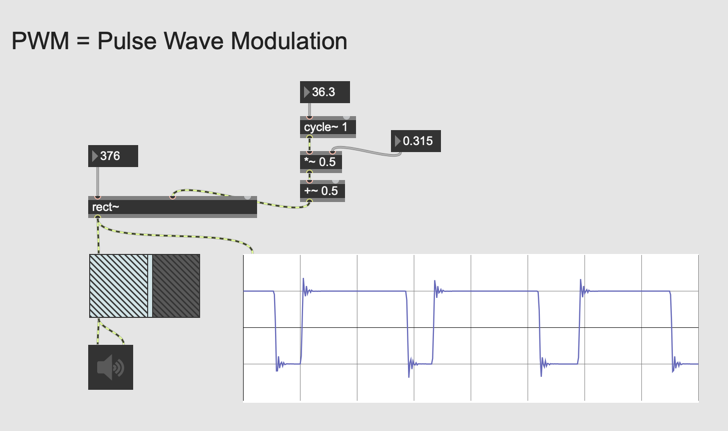
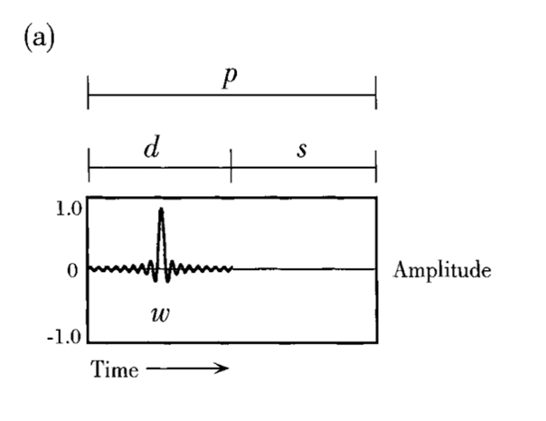
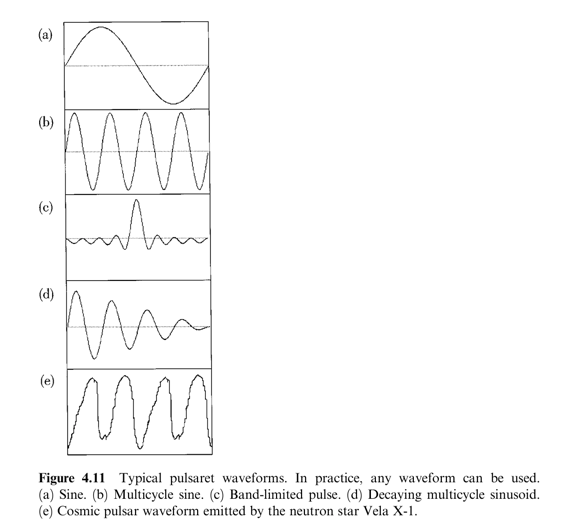
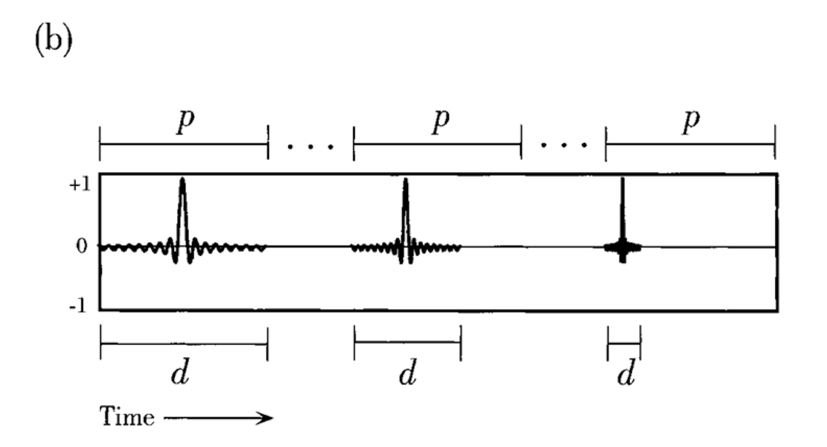
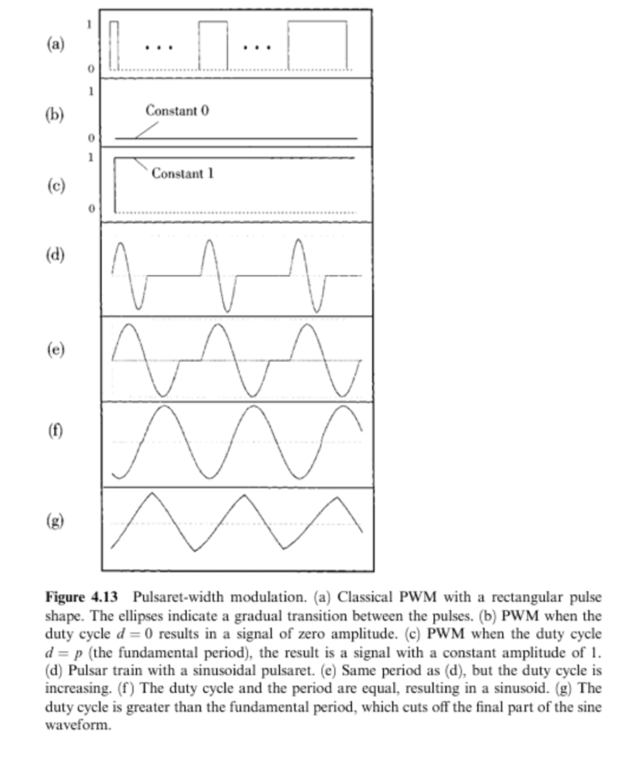
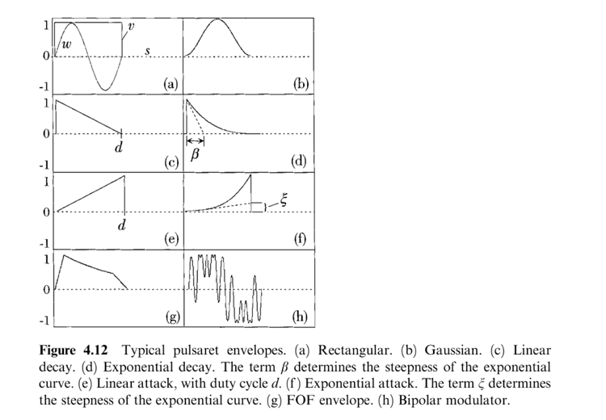

# K6 Particle Synthesis

[Curtis Roads Microsound](https://mitpress.mit.edu/9780262681544/microsound/)

- Glisson Synthese
- Trainlet Synthese
- Pulsar Synthese

## Glisson Synthese

In glisson synthesis, each particle or glisson has an independent frequency
trajectoryÐan ascending or descending glissando. As in classic granular synthesis, glisson synthesis scatters particles within cloud regions inscribed on the
121 Varieties of Particle Synthesis
time-frequency plane. These clouds may be synchronous (metric) or asynchronous (ametric)

### Noise and sah~

### Min/Max

### Randomization

### Assignment 1
Using the randomization patch, generate two different randomized numbers in the two different specified ranges every one second. Use those two numbers as frequency and play glissando between two numbers using sine wave.

### Assignment 2
After implementing the glissando, remove click noise heard at the end of the beginning of each glissando caused by the abrupt frequency jumps.

Hint: windowing

## Trainlet Synthese
A trainlet is an acoustic particle consisting of a brief series or train of **impulses**. Trainlets usually last between 1 to 100 ms. To create timevarying tones and textures, an algorithm is needed that can spawn thousands of trainlets from a few high-level specifications. 

### How to generate impulse in Max

### Spectrum of impulse

### Aliasing

> Since train let synthesis operates in the digital domain, its is
important that the impulse be band limited to avoid aliasing

As the spectroscope shows, a normal impulse contains a lot of aliasing artefacts.

### Solution: BLIP = Band Limited Pulse

- BLIP generates no Aliasing, because it is a composition of multiple **sinewaves** of the harmonics.

(a) Sum of eight harmonics  
(b) Sum of thirty-two harmonics

### BLIP table in Max

#### Sine

#### Harmonics

### Assignment 3

Create a patch that offers a number box. By putting a number N in the number box, the patch enables the user to generate blip in a buffer~ up to N harmonics instantly.

E.g. By giving 8 or 32, the buffer~ should be filled with the waveform shown in the figures above.

### Chroma Parameter

The motivation behind this parameter is change the timbre of impulse by changing the amplitude of each partial.

> Chroma is a spectral brightness factor. Chroma determines the relative strength of the harmonic series. If the lowest harmonic partial has a strength coeffcient of A, the lowest harmonic + n th partial will have a coeffcient of **A * (chroma ^ n)**, an
exponential curve. 
 
**A * (chroma ^ n)**

- A ... input
- chroma ... the parameter
- n ... the harmonic number (if the third harmonic it should be 3)

> The chroma may be positive, zero, or negative, and is not restricted to integers. If chroma is 1, the harmonics are of equal strength. If  chroma < 1, the higher harmonics are attenuated, as though the signal had been sent through a lowpass filter.

### Assignment 4
Add the chroma parameter to the original patch and control the timbre of trainlet synthesis.

## Pulser Synthese

### Pulse

### rect~ object in pulse

### Duty Cycle and its spectral effect
An impulse covers all frequency range and small duty cycle means the pulse becomes close to the impulse.

### Pulse Wave Modulation (PWM)

### Pulser synthese (PS)

Pulser synthesis
- consists of a palsaret waveform followed by silence
- one period of PS consists of parsaret and silence. 
- the ratio between parasaret and silence can be modulated (PWM)
- the waveform of palsaret is arbitarary
- An envelope could be applied to those palsaret

d = Duty Cycle  
s = silence  
p = period

#### Pulsaret variations

### PWM in Pulser synthesis

### Examples of envelope for Pulser Synthesis

### Assignment 1
Create a patch that plays back a waveform stored in buffer~ periodically using wave~ object. The frequency should be controllable by a number box.

### Assignment 2
In the patch of assignment 1, implement duty cycle parameter and let the user of the patch control the duty cycle.

### Assignment 3
Add one more buffer~ for envelop, fill the buffer with an envelope, and apply it to each pulsaret. Note the envelope has to scale according to 1. Frequency of the PS and 2. Duty cycle.

